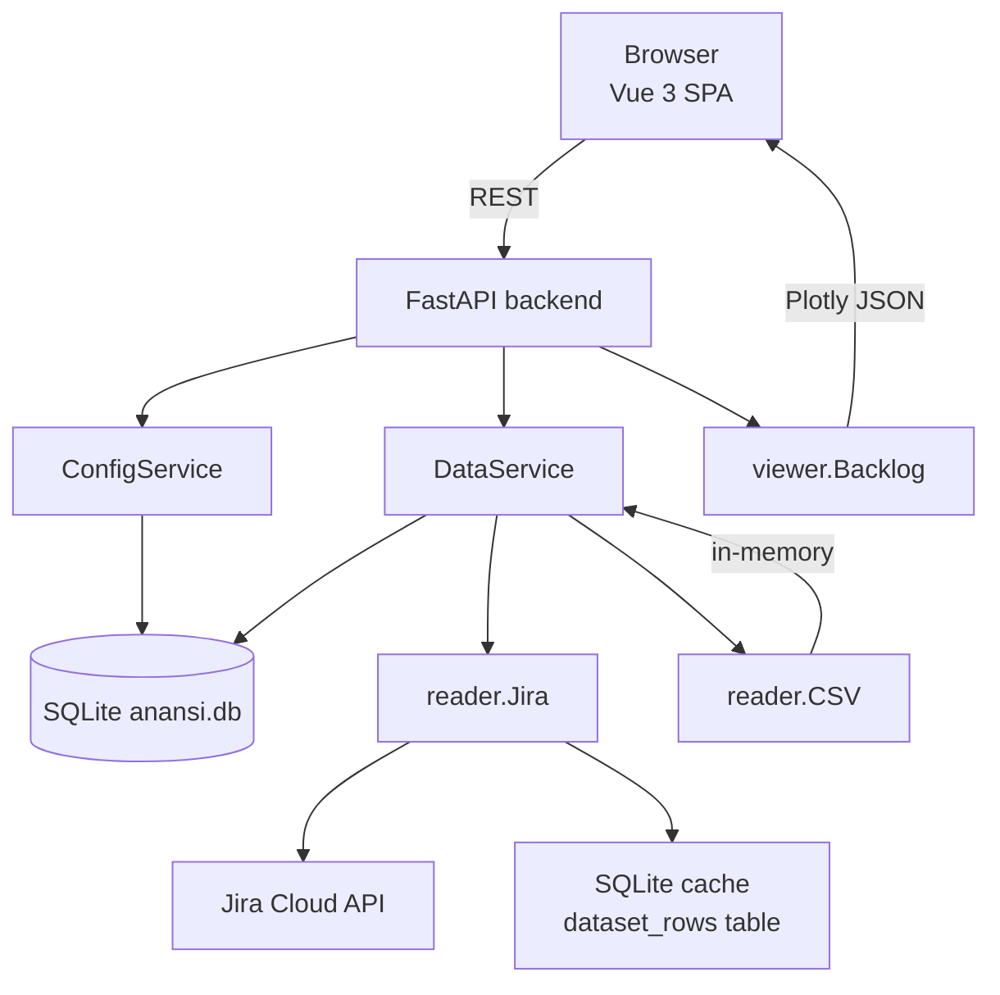
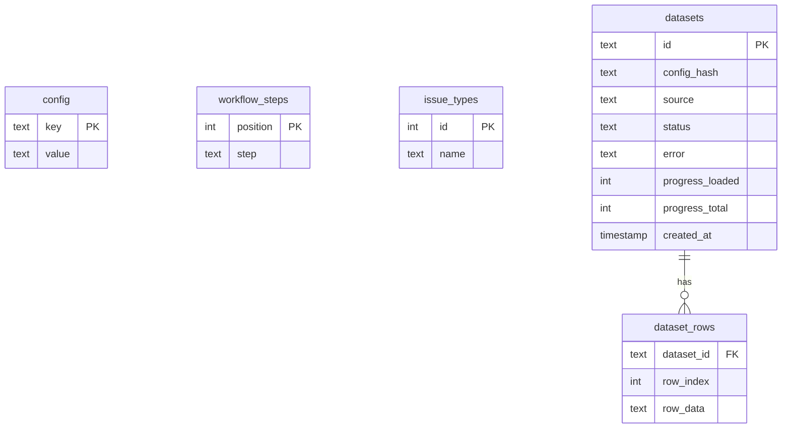
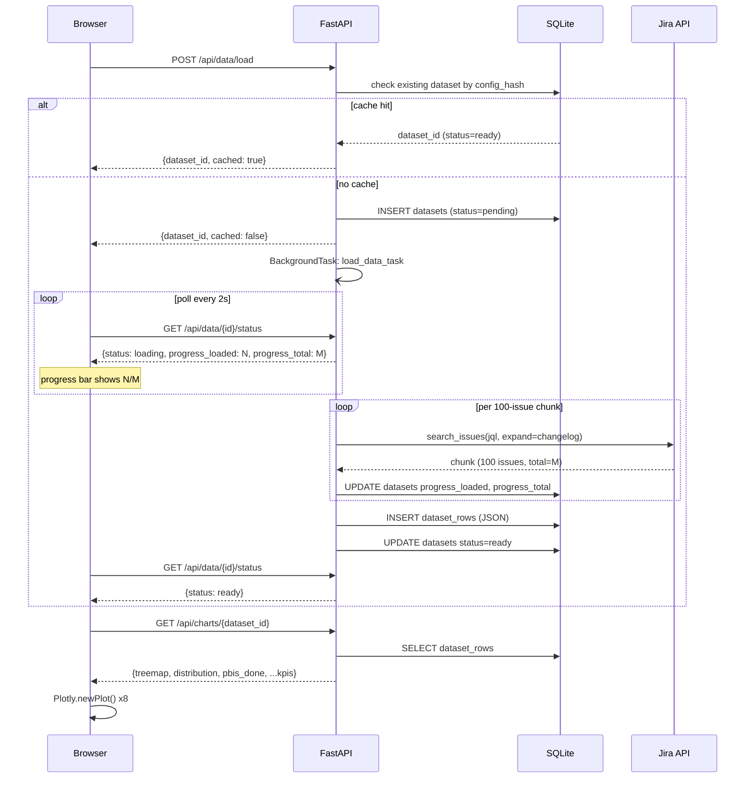
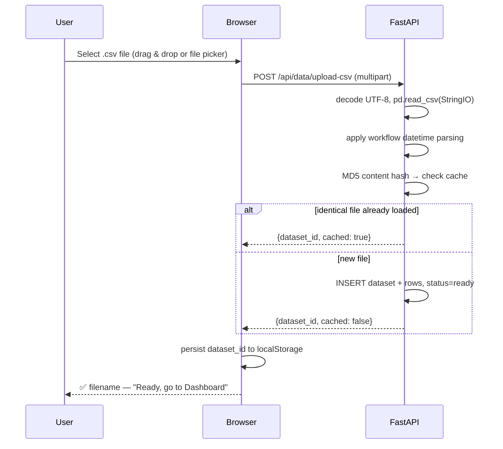

# Anansi Architecture Diagrams

## 1. Architecture (C4 Component)

```mermaid
graph TD
    Browser[Browser\nVue 3 SPA] -->|REST| FastAPI[FastAPI backend]
    FastAPI --> ConfigSvc[ConfigService]
    FastAPI --> DataSvc[DataService]
    FastAPI --> BacklogViewer[viewer.Backlog]
    ConfigSvc --> SQLite[(SQLite anansi.db)]
    DataSvc --> SQLite
    DataSvc --> JiraReader[reader.Jira]
    DataSvc --> CSVReader[reader.CSV]
    JiraReader --> JiraAPI[Jira Cloud API]
    JiraReader --> SQLiteCache[SQLite cache\ndataset_rows table]
    CSVReader -->|in-memory| DataSvc
    BacklogViewer -->|Plotly JSON| Browser
```

## 2. SQLite Schema ERD

```mermaid
erDiagram
    config {
        text key PK
        text value
    }
    workflow_steps {
        int position PK
        text step
    }
    issue_types {
        int id PK
        text name
    }
    datasets {
        text id PK
        text config_hash
        text source
        text status
        text error
        int progress_loaded
        int progress_total
        timestamp created_at
    }
    dataset_rows {
        text dataset_id FK
        int row_index
        text row_data
    }
    datasets ||--o{ dataset_rows : "has"
```

## 3. Sequence Diagram — Jira Data Load Flow

```mermaid
sequenceDiagram
    participant B as Browser
    participant API as FastAPI
    participant DB as SQLite
    participant JR as Jira API

    B->>API: POST /api/data/load
    API->>DB: check existing dataset by config_hash
    alt cache hit
        DB-->>API: dataset_id (status=ready)
        API-->>B: {dataset_id, cached: true}
    else no cache
        API->>DB: INSERT datasets (status=pending)
        API-->>B: {dataset_id, cached: false}
        API-)API: BackgroundTask: load_data_task
        loop poll every 2s
            B->>API: GET /api/data/{id}/status
            API-->>B: {status: loading, progress_loaded: N, progress_total: M}
            note over B: progress bar shows N/M
        end
        loop per 100-issue chunk
            API->>JR: search_issues(jql, expand=changelog)
            JR-->>API: chunk (100 issues, total=M)
            API->>DB: UPDATE datasets progress_loaded, progress_total
        end
        API->>DB: INSERT dataset_rows (JSON)
        API->>DB: UPDATE datasets status=ready
        B->>API: GET /api/data/{id}/status
        API-->>B: {status: ready}
    end
    B->>API: GET /api/charts/{dataset_id}
    API->>DB: SELECT dataset_rows
    API-->>B: {treemap, distribution, pbis_done, ...kpis}
    B->>B: Plotly.newPlot() x8
```

## 4. Sequence Diagram — CSV Upload Flow

```mermaid
sequenceDiagram
    participant U as User
    participant B as Browser
    participant API as FastAPI

    U->>B: Select .csv file (drag & drop or file picker)
    B->>API: POST /api/data/upload-csv (multipart)
    API->>API: decode UTF-8, pd.read_csv(StringIO)
    API->>API: apply workflow datetime parsing
    API->>API: MD5 content hash → check cache
    alt identical file already loaded
        API-->>B: {dataset_id, cached: true}
    else new file
        API->>API: INSERT dataset + rows, status=ready
        API-->>B: {dataset_id, cached: false}
    end
    B->>B: persist dataset_id to localStorage
    B-->>U: ✅ filename — "Ready, go to Dashboard"
```
